# Might and Magic II: Gates to Another World — 繁體中文 remake

以 New World Computing 的《Might and Magic II》DOS 版為 oracle，在 Go／Ebiten
重寫可跨平台遊玩的引擎，再接上繁體中文。定位是文化資產保存；公開儲存庫不含
原版程式、資料、美術或音樂，玩家必須自備合法原版。

## 遊戲介紹

《Might and Magic II: Gates to Another World》是 New World Computing 1988 年的角色扮演遊戲。
玩家組一支六人隊伍，在名為**科隆（Cron）**的大陸上探險：畫面是第一人稱的格子視角，
走一步過一格，右上角同時開一扇 5×5 的地形視窗，遊戲會自動把走過的地方畫成地圖。

下面的世界觀與譯名取自 **珍017《魔法門 II》中文說明書**（軟體世界代理的繁體中文版，
全書 93 頁的轉錄在 [`docs/manual/`](docs/manual/)）。

### 科隆的十世紀

天地之間原本只有太虛。虛無裡出現能發展生命的物質，水與**以太**混在一起，
誕生了最早的種族 —— 科隆的歷史從這裡開始算。

接下來的幾百年是四支自然種族的混戰：水種之首**亞郭蘭大（Acwalandear）**、
風之精靈的**雪文（Shalwend）**、火焰主宰**皮倫奈斯特（Pyrannaste）**，
以及自稱大地之尊、由**葛拉格（Gralkor the Cruel）**領軍的土族。
水、風、火三族聯手把土族根除，卻來不及阻止他們留下的東西：
一塊浮在水上、燒不壞也吹不散的大陸。那塊地就是科隆。

第七世紀，一群小小的生物在葛拉格的作品上繁衍起來 —— 人類。
水從他們身上滴落，風繞著他們吹過，火燒得傷他們卻很少燒死他們；
更要緊的是，人類能從四種自然力裡提取精華，**施展法術**。
最有本事的法師聚在**古代之島**上，合力造出一顆能源水晶球，底座四爪各對應一種自然力。

第八世紀末，一個法力不高但夠有膽的人**卡隆（Kalohn）**試了那顆球並且活了下來。
他登上科隆最高的山峰向四大主宰挑戰，把它們放逐到大陸的四個邊區，各留一爪看守；
那一戰把整座山打成了一個大坑，就是**死城（Dead Zone）**。卡隆從此成為魔術師卡隆國王。

第九世紀中葉諸神反擊。亞郭蘭大造出一頭注入子民生命、被賦予火的巨獸 —— 史上第一頭**火龍**。
卡隆在**富足的大草原**迎戰，水晶球卻已幾乎暗淡無光；他最後想用法術造一道水牆保護自己，
造出來的卻是一場大洪水，把自己和整片草原一起淹了。那片草原此後叫做**亡命沼澤**，
水晶球據說還埋在裡面，至今沒人找到。

火龍長驅直入，卡隆的女兒**拉曼達公主**臨時接下這片大地，文明一路倒退。
說明書把玩家接手的時間點寫成一句話：**「現在是混亂的十世紀，劍及巫術取代原本生活中的法律及秩序。」**

### 序章：柯拉克去了哪裡

遊戲開場是一份第一人稱報告，寫的人是年輕的**昆登（Gwyndon）**，
魔術師**柯拉克（Corak the Mysterious）**的徒弟。

柯拉克在追一個從另一個現實世界潛逃進科隆的罪犯。昆登偷聽到師父自語，
聽見科隆已經和一個叫**席頓（Sheltem）**的危險異形脫離了聯合狀態，
還聽見一句預言：在可怕的波濤與無情的破壞橫掃科隆之前，會有一位神聖的鬥士重整大地。

那陣子柯拉克進出研究室之後常有形貌上的改變 —— 有一次出來時全身變成褐色，
像是到墨里休閒小島曬了一星期太陽。某天他取出一隻四爪的奇異短棒施法，
在一聲巨響之後消失了。一星期後來訪的潘赫特城主同樣在研究室裡消失，
柯拉克的一項機械也跟著不見。隔天城主捎來一封信，要昆登前往潘赫特城堡繼續學習。

席頓這個名字會在遊戲最後再出現一次 —— 他就是結局控制室裡守門的那位。

### 玩起來是什麼樣子

說明書背面列的賣點，照原樣是這六條：超過 250 種活動怪物畫面及武器裝備、
多出野蠻人和忍者兩種職業、可僱用其他冒險者加入隊伍、多出 15 種技能、
具有自動繪地圖功能、立體前視圖和活動地圖視窗混合。

隊伍最多六人，從五個種族（人類、精靈、矮人、侏儒、半獸人）與八種職業
（武士、遊俠、弓箭手、牧師、巫師、賊、忍者、野蠻人）裡挑 ——
**這些職業與種族的中文都用說明書的官方譯名**，不是我們自己翻的。
科隆有五座城可以落腳，城外是二十四張野外圖、地城、城堡與四座元素平面。

## 現況

**完成度約 95%。**

基準是「距離一個可以公開發行的 1.0 還差什麼」。工作清單 36 項結案 32 項。
沒結的四項裡，三項卡在外部條件（建立公開儲存庫、Windows／macOS 真機驗收、
推廣片人耳驗收），第四項是讀完社群資料之後新開的：社群回報的九條原版 bug
還沒有一條回去對過反組譯（[`docs/research/07`](docs/research/07-blurglecruncheon.md)）。

| 面向 | 完成度 | 依據 |
|---|---|---|
| 玩家路徑 | 100% | 建角色 → 結局全程走得通，走的都是正常 UI |
| 中文化 | 100% | 翻譯工作檔 2,703／2,703 |
| 逆向覆蓋 | 100% | 14／14 個 overlay 反組譯完，事件 49／49 個 opcode、法術 96／96 條、71 個非空事件段全部解得開 |
| 與原版對照 | 約 95% | 第一人稱 14 個對照座標裡 13 個逐像素 0.0%；少數項目仍標強推論（怪物動畫的用途對應、光照消耗算在哪一格）|
| 三平台交付 | 約 70% | 六個包都封好也在容器內驗過，但 Windows／macOS **真機沒開過**，macOS 也還沒簽章與公證 |

「約」不是客套 —— 對照與交付這兩列沒有可以數的分母，寫出來的是還剩幾件
具名的事，不是量出來的比例。逐項狀態在 [`docs/todo.md`](docs/todo.md)。

名冊、探索、事件、戰鬥、施法、商店、旅店、神殿、訓練、寶箱與存讀檔都在正常
UI 路徑上，任務線與結局控制室也接完了。**走得通不等於每一條原版行為都取得了
parity oracle** —— 哪些對照過、哪些還是強推論，逐項列在後面那張表。

解出來並且已經實作的部分：

- **任務線**：兩位領主（Hoardall 找裝備、Slayer 獵怪，四個難度）、八大職業考驗、
  競技賽、年代之門與時空旅行、馬戲團、酒館的酒餐與四十則傳聞。整理成
  [`docs/quests.md`](docs/quests.md)（觸發、目標、驗收、獎勵）與
  [`docs/tavern-rumors.md`](docs/tavern-rumors.md)（傳聞的中英對照）
- **戰鬥**：九個指令、近身攻擊附帶的三十種效果、怪物遠程與法術攻擊的三十二種、
  八個狀況位元。抵抗走三條通道 —— 魔法抗性整發擋掉、幸運過關減半、元素抗性再減
  四分之一（`sub_1B2DE` 與 root `sub_13928`）。下攻擊指令會先問打哪一隻，
  近戰列前排、射擊列全場（射擊的價值是打得到後排，不是命中率比較高）
- **結局控制室**：守門的 Sheltem 與四隻元素生物、`WAFE` 中止碼、替代加密的密碼題、
  15 分鐘倒數、每人五千萬經驗與最終分數
- **四個平台的素材**：DOS、Amiga、MSX2、Mega Drive 各自逆向、全部接進遊戲，
  遊戲中按 `F6` 整組切換，五套素材在地城、城堡與野外都畫自己的圖。
  MSX 的戶外連「哪一張擋路物、哪一段地平線、哪一張地面」都照原版依地圖挑，
  格子碼讀的是 MSX 自己的地圖檔而不是 DOS 的。Mega Drive 的 16 首配樂是預設音源
- **第一人稱與原版逐像素相同**：十四個對照座標裡十三個 0.0%（剩下一個是
  原版招牌對上 remake 的中文）。透空走的是原版**存在影像集裡的 1-bit 遮罩**，
  不是從色號推的 —— 版面出自 `EGA.DRV` 的貼圖常式

反組譯這一側，14 個 overlay 裡有七個已無未解項（`1MENU1`／`1RETINN`／`2CAVES`／
`2BRAIN`／`2CMDS`／`2SMITH`／`2COMBAT`），其餘七個玩家路徑上的機制也都追過；
622 個函式符號有可查索引（[`docs/re/00-function-index.md`](docs/re/00-function-index.md)），
各 overlay 的覆蓋狀態見 [`docs/re/README.md`](docs/re/README.md)。


框線照原版 —— 四個紅框圍出第一人稱視圖、右上那一格、`Day／Year／Face`
那條橫列與下方大框，座標是拿原版素材去 DOSBox 實機截圖上做樣板比對量出來的。
**框裡放什麼則按中文重新分配**：原版把隊伍擠在下面兩欄各三列，一欄 154 px
放不下完整名字，更放不下中文職業；這裡把隊伍移到右邊那一格（六列，各有
編號、完整名字、職業與生命），下方整塊留給對話。戰鬥中也看得到隊伍狀態，
原版看不到。

**文字走獨立的高解析點陣層疊在原版像素上**，原版的 320×200 骨架一個像素
都沒改。中文 24×24 全形、英數字 12×24 半形，同一個字族（Noto Sans CJK ／
Noto Sans Mono）—— 英文如果留在原版那套 8×8 放大三倍，方塊像素會比中文粗一截。
兩層疊在同一張畫布再整張送出去，所以拉動視窗時等比例一起縮放，
文字不會相對原版像素跑掉。上圖那段神殿招呼語是 `STR.DAT` 的實際譯文。

開機是原版的片頭畫面，按任意鍵進遊戲：

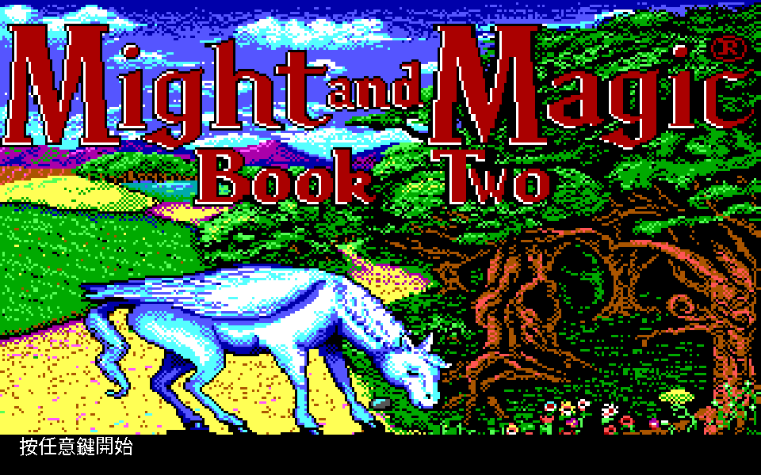

底圖與 13 張疊圖都在 `MASTER.16` 裡。**疊圖的透空色與落點是拿實機截圖
定出來的**：把每張圖在整個 320×196 上滑動，找「非透空像素與截圖逐格相同」
的落點 —— 判準夠硬，落點錯一格，不合的像素就從 0 跳到 391。獨角獸的頭尾
一直在動，樹叢裡藏著幾張臉會輪流探出來（上圖是左邊那張）。

結局那道密碼題是全遊戲唯一沒辦法直接翻譯的東西：

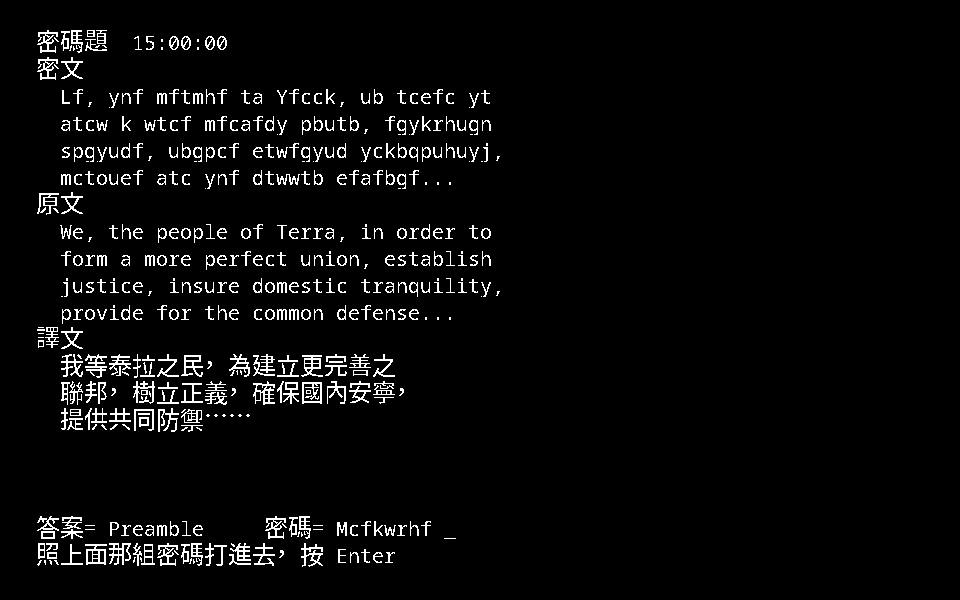

密文是英文字母的替代加密，字母表每次進控制室重抽，明文是美國憲法序言的
改寫版。中文沒有字母可以代換，照翻的話玩家永遠解不開，所以這裡把密文、
英文原文與中文譯文三份一起攤開 —— 對照前兩份就看得出字母怎麼換 ——
再把編碼後的答案附在輸入欄旁邊。**比對邏輯一個字都沒改**，
仍然是拿 `Preamble` 用當次那張表編碼出來的八個字元。

更多畫面見 [`docs/screenshots/`](docs/screenshots/)。

| 領域 | 狀態 |
|---|---|
| 中文化 | **2,703／2,703（100%）** |
| overlay 與記憶體佈局 | 14 個 overlay 全部反組譯，七個已無未解項；622 個函式符號有可查索引 |
| 檔案格式 | 壓縮、圖形、字型、文字、地圖、事件、物品、怪物、法術全部解開；LZW 連編碼器都有（`cmd/mm2patchevent` 靠它改寫事件檔當 oracle）|
| 事件腳本 | 用到的 49 個 opcode 全部有語意也全部有分支，71 個非空段全部解得開 |
| 戰鬥 | 九個指令已接上；攻擊前挑目標（近戰列前排、射擊列全場，都夾在 10）；近身的三十種附帶效果與怪物遠程／法術的三十二種都照原版分派；一般勝利留下戰利品，按 `S` 搜尋才進四選項寶箱；`F8` 一路打完 |
| 法術 | 96 條有 typed handler；隊員、物品、數字與飛行欄列提示已接正常 UI。**確認前不扣 SP／寶石**，與原版逐次量過一致。戰鬥中的怪物目標提示也量過了：問的是 `On which (A-J)?`（場上全部，不是前排），`Esc` 不扣 |
| 水行術 | remake 於休息、換圖與傳送清除；**存檔會保留**（與原版一致 —— 原版把那批旅行效果寫在 `ROSTER.DAT` 尾端，實機量過）|
| 開門 | 機制已結案並經實機複驗：翻的是屬性層的牆位元（只翻站的那一格），同圖內保持開著、離圖再回整層從 `MAP.DAT` 重讀（root `sub_13A64`）|
| Theme | DOS／Amiga／MSX2／Mega Drive／Modern 完整素材組可於啟動時選擇，遊戲中按 F6 原子切換。MSX 的戶外走它自己的第三條繪圖路徑與自己的地圖資料 |
| 音樂 | **預設 Mega Drive**（16 首逐首從 ROM 擷取，場景對照全部由模擬器中斷點量到）；MSX／Amiga／DOS 音樂包可替換，公開 repo 不附原版音檔 |
| 原版 oracle | DOSBox headless（一鍵跑到第一人稱視角，可送鍵、截圖、傾印記憶體）；Mega Drive 走 BlastEm 的 GDB stub |
| 怪物動畫 | 正常戰鬥 UI 依原始影格 hold 播放第一個合法序列；用途對應暫列強推論 |
| 結局 | 控制室整條接完：守門的 Sheltem 與四隻元素生物、`WAFE` 中止碼、替代加密的密碼題、15 分鐘倒數、每人五千萬經驗與最終分數 |
| 第一人稱 | 與原版**逐像素相同**（`cmd/mm2diff -oracle` 十四個座標裡十三個 0.0%）。落點是 DGROUP 的六張表、透空是影像集自帶的 1-bit 遮罩，兩者都從反組譯讀出來並有測試守著 |
| 時間 | 走一步過一單位：**256 步一天、180 天一年**，跨日時每個隊員的年齡加一天（root `0x150CE`）|
| 暗處 | 沒有照明術進地城**整塊不畫第一人稱**，只印一行字 —— 原版不是調暗，是不畫 |
| `F2` 的三個選項 | 事件獎賞自動入袋（預設開）、入夜視野變暗（預設關）、進設施先講一段場景（預設關）。後兩個**不是 DOS 的行為**，理由與出處寫在 `docs/polish-spec.md` |
| 前端 | Ebiten 視窗；互動邏輯與視窗系統無關，headless 也跑得起來 |

玩家路徑上的機制都與原版對照過了。剩下的是**要外部條件才做得了**的三項
（公開 repo、Windows／macOS 真機、推廣片人耳），加上社群資料帶進來的一項
待裁決（九條原版 bug 逐條回反組譯）。完整清單與下一步在
[`docs/todo.md`](docs/todo.md)。

## 這個專案留下了什麼

《魔法門 II》1988 年出，沒有官方中文版，也沒有公開的引擎原始碼。
下面這些是從零做出來、並且留在儲存庫裡可以被後人接手的東西。

**把一款 1988 年的 DOS 遊戲拆到可以重寫。** 14 個 overlay 全部反組譯，
622 個函式符號有可查索引；overlay 載入機制、記憶體佈局、DGROUP 的十張表
都寫成規格。檔案格式從壓縮、圖形、字型、文字、地圖、事件腳本、物品、怪物
到法術全部解開 —— LZW 連編碼器都寫了，因為改寫事件檔丟回原版執行是驗證
手段之一。每個斷言標推論等級，`已證實` 必須附得出位址、位元組範圍與可重跑
的實驗。

**不只 DOS。** Amiga（1989）、MSX2（1989 日版）、Mega Drive（1991）三個版本
的容器、壓縮、調色盤與繪圖路徑各自逆向，素材全部萃取並接進遊戲，按 `F6`
整組切換。其中 MSX 的戶外第一人稱是它自己的第三條繪圖路徑（哪一張擋路物、
哪一段地平線、哪一張地面都照原版依地圖挑），Mega Drive 的第一人稱與模擬器
的組合緩衝區逐像素相同（24,960 個像素全中），16 首配樂逐首從 ROM 擷取，
場景對照是用模擬器中斷點量出來的。

**一份能玩的繁體中文版。** 2,703 條文本全譯，中文走獨立的高解析點陣層疊在
原版 320×200 像素上，原版骨架一個像素都沒改。珍017 中文說明書 93 頁轉錄、
統一譯名表、294 條帶出處的攻略提示都進了遊戲與文件。

**可重跑的驗證方法，不是「看起來對」。** DOSBox 與 BlastEm 都容器化成
oracle（送鍵、截圖、傾印記憶體、下中斷點），`cmd/mm2diff` 拿原版截圖逐像素
比對；477 條測試守著解出來的規格。所有工具鏈（56 支）都在 `tools/`。

**踩過的坑寫成規則留著。** 63 份文件、兩萬多行，其中一份專門記
[已被推翻的斷言](CONTEXT.md) —— 哪個結論錯了、當初憑什麼相信它、
後來憑什麼推翻。這一份對接手的人比正確答案更有用。

原版程式、資料、美術與音樂一律不散布；公開的只有引擎程式碼與翻譯文本，
玩家自備合法原版。

## 玩

```bash
go run ./cmd/mm2 -data <你的 MM2 目錄> -theme dos
```

視窗可以任意拉大縮小，畫面等比例縮放並置中。

若已在本機準備音樂包，可加上：

```bash
go run ./cmd/mm2 -data <你的 MM2 目錄> \
  -music-pack <音樂包目錄>/manifest.json
```

**不給 `-music-pack` 也會自己找**：`workplace/genesis/music/`、
`workplace/music/`、執行檔旁邊的 `music/` 依序試，找到就播、找不到就靜音。
**預設是 Mega Drive** —— 四個平台裡只有它的 16 首場景曲目是逐首從 ROM 擷取、
逐一對到場景的。MSX、Amiga 與 DOS 可作替換音源。音樂包只接受 PCM WAV，
會在播放前整包驗證；格式、完整性與權利邊界見 [`docs/music.md`](docs/music.md)。

↑ 前進、↓ 後退、← → 轉向、Enter 推進、Y／N 回答、R 休息受訓、C 施法、
B 撞門、U 開鎖、S 搜尋、M／F3 地圖、W 世界地圖、K／Q 查說明書、I 物品、G 商店、
N 建角色；戰鬥中 Enter 攻擊、T 射擊、C 施法、A 抵擋、F 溜跑、
P 防護、V 檢視、X 對調、**F8 快速戰鬥**（一路打到分出結果）。

功能鍵在任何畫面都是同一件事 —— 探索、戰鬥、選單、訊息、地圖都一樣，
按下去不會把你現在那一頁關掉：

| 鍵 | 做什麼 | 在哪裡有效 |
|---|---|---|
| `F1` | 說明（指令一覽，與 `K`／`Q` 同一頁）| 任何畫面。再按一次收起來 |
| `F2` | 設定 | 任何畫面。再按一次收起來 |
| `F4` | 存檔 | 任何畫面。存完留在原來那一頁 |
| `F5` | 換牆面的畫法（原版像素 ↔ Scale3x）| 任何畫面 |
| `F6` | 換素材來源平台 | 任何畫面 |
| `F10` | 離開遊戲 | 任何畫面。**先自動存檔** |
| `Esc` | **一律是取消，永遠不是離開遊戲**。訊息也收得掉 | 任何畫面 |

`F8`（快速戰鬥）與 `F3`（地圖，同 `M`）不在這一組 —— 它們是遊戲指令，
只是借了功能鍵的位置。

`Esc` 唯一不收的是**問你 Y/N 的提問** —— 那是在等一個答案，取消鍵不能被偷當成
其中一邊。除此之外任何訊息按 `Esc` 都收得掉，跟 <kbd>Enter</kbd> 一樣。

**功能鍵唯一的例外是「有東西正等著你按鍵」的畫面**：事件腳本停在提問、施法停在
選目標、正在打字、正在建角色。那幾個狀態既回不去也存不起來，所以 `F1`–`F6`
一律不介入。這不是當掉 —— 按 `Esc` 取消掉提示，功能鍵就恢復。

> 這一段到 2026-08-20 才真的成立。先前 `F1`–`F6` 只寫在探索與戰鬥兩個分支裡，
> 選單與訊息模式一律吃掉不回應，而**按了沒反應與程式當掉，玩家分不出來**。
> 同一個症狀還有另一個來源：那幾支都會切到訊息模式，而訊息模式只吃 <kbd>Enter</kbd>，
> 所以在文字被洗掉的那個版本裡，按下 `F4` 之後方向鍵就整個失效。
> 兩個都修掉了，`internal/ui/functionkey_test.go` 把上面那張表釘住。

`B`／`M`／`Q`／`R`／`S`／`U` 與原版同鍵（見
[`docs/research/command-keys-oracle.md`](docs/research/command-keys-oracle.md)），
其餘是原版沒有的功能，放在原版沒用到的字母上。

**`C` 是刻意不同的**：原版移動時的 `C` 是設定視窗（音效／腳步聲／`Delay`），
施法要先按人物編號開角色卡、再按卡片上的 `C`。remake 把施法提到探索畫面直接按 `C`，
設定則收進 `F2`（理由見 [`docs/polish-spec.md`](docs/polish-spec.md) D3）。

`F2` 那一頁放的是**remake 刻意與原版不同的地方**。差異本身有理由
（記在 [`docs/polish-spec.md`](docs/polish-spec.md) §4），但不該由我們替玩家決定死 ——
想照原版玩的人在這裡切回去。目前有一項：事件擺下的獎賞是自動入袋（預設），
還是照原版等玩家按 `S` 才拿。

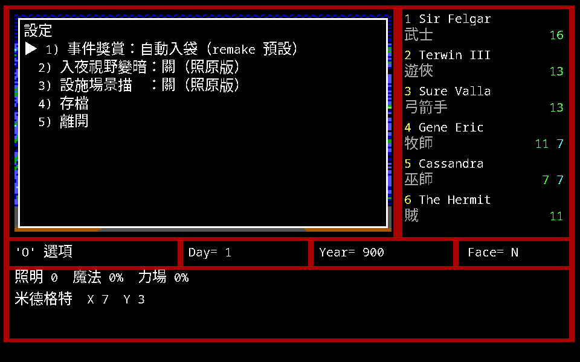

戰鬥勝利留下的戰利品要**按 `S` 搜尋**才撿得起來，照原版
（`2PLAY` 指令分派 `0x181E8` → root `0x13814`，見
[`docs/research/command-keys-oracle.md`](docs/research/command-keys-oracle.md)）。
沒有東西可撿時會回「這裡什麼都沒有。」，對應原版的 `Nothing Here!`。

`F5` 在兩種牆面畫法之間切換：原版像素（nearest 整數倍放大）與 Scale3x
（色塊邊界補斜角）。兩種畫的是同一批原版素材、同一組顏色，差別只在放大方式 ——
中文走 24×24 點陣，與 8×8 放大三倍的牆面像素密度差三倍，Scale3x 讓兩者接近。

`F6` 換素材來源：DOS → Amiga → MSX → Mega Drive → 高解析素材包 →
Mega Drive 的怪物 → Amiga 的怪物。只有完整通過牆面、地板、火炬與天空契約的
素材組才會加入循環，切換時整組替換，不會混到兩個平台的圖；最後兩套換的只有
戰鬥畫面裡的怪，牆沿用 DOS。**這台機器上沒有的平台不會出現在循環裡** ——
少了 MSX 的 `.dsk` 就直接跳過，不會拿隔壁那套頂替。

```bash
go run ./cmd/mm2 -data <MM2> \
  -amiga-dir <Amiga 素材目錄> \
  -msx-dir <MSX 磁片目錄> \
  -md-scene-dir <Mega Drive 場景素材> \
  -modern-dir <Modern 素材包> \
  -theme amiga
```

`-theme` 接受 `dos`、`amiga`、`msx`、`megadrive`、`modern`；明確指定但素材不完整時
會停止並說明錯誤，不會安靜退回 DOS。DOS 與 Amiga 走**同一套幾何**，
換的只是圖 —— `town.32` 與 `TOWN.16` 都是 32 張、同樣的深度與側牆順序，
所以 Amiga 版的牆可以直接貼進原本的透視裡。真正的差別只有兩個：
透空色（DOS 是色號 8、Amiga 是 0）與火炬的張數（DOS 每格四張含燈桿底圖，
Amiga 只有三張火焰）。Amiga 素材要放在 `workplace/amiga/`（自備原版磁片，
用 `tools/adf.py` 抽）、MSX 的 `.dsk` 放 `workplace/msx/`，沒有就只有 DOS 可選。

MSX 那一套是另一種接法：**素材不是一張一張的檔案**，整套場景是一張
462×128 的素材表，每一面牆是表裡的一塊矩形，落點另有一張表
（`internal/assets/msx`）。原版靠 VDP 的矩形搬移組出畫面，remake 直接
切圖來貼 —— 不需要模擬 VRAM。視圖只有 154×64，整幅置中放進視圖區。
目前接上的是側牆四個深度、正牆深度 0／1／3、門與火炬各幾個深度；
更深處的門與火炬、還有正牆深度 2 沒有定位（正牆深度 2 的來源矩形落在
素材表右緣之外，見 [`docs/todo.md`](docs/todo.md) A8）。**沒定位的那幾格不畫**，
不拿別的圖頂替。
**MSX 原版的火炬不會動**（每個位置只有一張貼圖，沒有 DOS 那種三張火焰的動畫組），
remake 把火焰左右各位移一像素做出三張影格 —— 那是加上去的效果，不是還原。

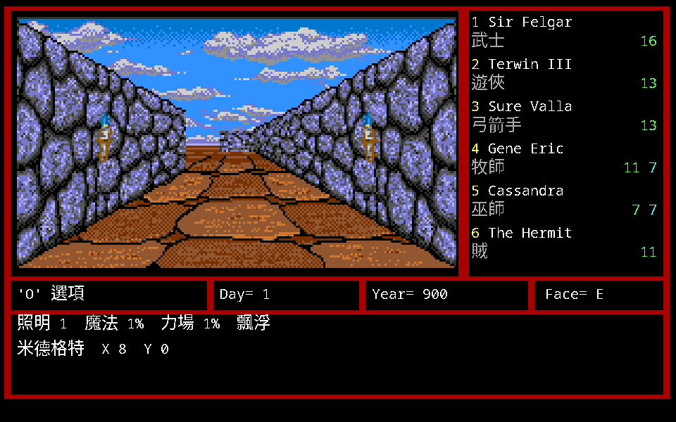

Mega Drive 那一套又是另一種切法。視圖大小與 DOS **完全相同（208×120）**，
但牆面的分法不一樣：DOS 每個深度各一張左右側牆，Mega Drive 把一整根側牆柱
烘成一張 120 高的圖，八根的寬度 24｜32｜24｜16｜16｜24｜32｜24 左右對稱、
加起來剛好鋪滿 208。地板與天空是另外兩張 208 寬的點陣圖，貼在視圖的第 61 列
與第 0 列。

**火炬不進那個組合緩衝區**：`sub_3836` 是十八段展平的程式碼，直接把 tile 編號
寫進 nametable，四個引數就是行、列、寬、高。視圖佔 nametable 的第 2–27 行，
所以視圖座標 ＝（行 − 2）× 8，鏡射用的常數是 30。53 個 tile 依這十八段分下去
剛好切成八張圖，一張不多一張不少 —— 這個「剛好分完」本身就是幾何對不對的驗收。
火焰的顏色逐幀換：ROM `0x0BF4DC` 那張 9 個字的色表配三個取樣點，
一個相位 5 幀、整圈 45 幀。remake 接了九組，含 DOS 沒有的正牆深度 1。

素材用 `tools/mdscene.py` 烘：

```
python3 tools/mdscene.py <你的 ROM> --export workplace/md-scene
```


高解析素材包用 `cmd/mm2modern` 烘：

```
go run ./cmd/mm2modern -data <你的 MM2 目錄>          # → workplace/modern
go run ./cmd/mm2modern -amiga workplace/amiga -out workplace/modern-amiga
```

烘出來的是一疊 PNG 加一份 `set.json`。與 `F5` 的 Scale3x 畫的是同一件事，
差別在**它是檔案，可以被換掉** —— Scale3x 的上限就是原版像素的資訊量，
真正重畫的美術需要一個「檔案放這裡、尺寸與命名照這個規矩」的地方。
遊戲先找 `assets/modern`（重畫的原創美術），再找 `workplace/modern`
（自己從原版烘的，不進版控）。

## 推廣片與三平台封包

三平台封成玩家真的會拿到的格式，全部在 Docker 內建立：

| 平台 | 產物 | 怎麼開 |
|---|---|---|
| Linux x64 | `.AppImage`（單檔）| `./檔名.AppImage /path/to/MM2` |
| Windows x64 | `.zip`（每一筆都標 UTF-8）| 解開後 `run.bat C:\MM2` |
| macOS universal | `.zip`，裡面是 `MM2-CHT.app` | 雙擊，第一次問原版資料在哪 |

```bash
bash tools/package.sh public linux-x64          # 公開包，玩家自備原版資料
bash tools/package.sh local-full linux-x64 --data-dir <你的 MM2 目錄>
bash tools/collect_dist_all.sh                  # 六個包 ＋ 推廣片集中到 dist-all/
```

公開包只含引擎、譯文、字型與原創圖示，逐檔比對 allow-list；含原版資料的完整版
只留在被忽略的 `.local-full/`，不得提交或上傳。Windows 包不夾帶 DLL —— 執行檔是
`CGO_ENABLED=0` 的純 Go，PE 匯入表只有 `kernel32.dll`，其餘都是 Windows 系統元件，
實測清單附在包內的 `WINDOWS-DLL.txt`。細節與已驗／未驗的界線見
[`docs/packaging.md`](docs/packaging.md)。

推廣片使用當前引擎重新截圖，出兩個配樂變體：一版是玩家自備 `MM2.EXE` 的原始
音高／時值資料離線轉譯成的 PC 喇叭（PC speaker）方波組曲（medley），一版用
Mega Drive 的原始配樂。畫面相同，只換音軌。

```bash
bash tools/render_promo.sh --data-dir <你的 MM2 目錄>
```

輸出在被 Git 忽略的 `workplace/promo/`。影片含原版衍生視覺與音源，預設只留本機；
那個 WAV 不是 DOSBox 原始錄音。公開前必須另行確認素材權利或換成可再散布的原創
Theme。分鏡、重拍方式與音源證據見 [`docs/promo.md`](docs/promo.md)。

## 各版本素材總覽

DOS 之外還有三個平台。**四套素材是各自逆向出來的，容器一個都不一樣**，
彼此沒有共用的格式；共通的只有美術本身 —— 同一批畫，各自重新上色與重排。

| 平台 | 發行 | 容器 | 顏色 | 破解點 |
|---|---|---|---|---|
| DOS | 1988，New World Computing | `.16`：LZW 段內含影像目錄 | EGA 16 色 | LZW 變體，見 [`docs/formats/03`](docs/formats/03-lzw-compression.md) |
| Amiga | 1989 | `.32`：目錄 + 32 色盤 + nibble RLE 的 5 個位元平面 | 32 色（12-bit RGB） | 解碼器在 `mm2` 的 `sub_33EF2` |
| Mega Drive | 1991，Electronic Arts | ROM 內的區塊：LZSS，前面**可能**有 9-bit 調色盤 | 16 色 × 多組 | LZSS 在 ROM `0x29954` |
| MSX2 | 1989，Starcraft（日版） | 兩張 192 筆的磁區表；每張圖 `NX/NY` 檔頭 + RLE | MSX2 16 色 | RLE 在常駐區塊 `0xC51A` |

三個非 DOS 平台都走過同一條冤枉路：**先猜編碼參數猜了幾百組，全錯；
改成讀機器碼，第一次就對**。詳細的過程、走不通的路與不要重複走的路
記在 [`docs/research/02-other-platforms.md`](docs/research/02-other-platforms.md)。

### DOS（1988）

牆面、地形、火炬、天空 —— 239 張。第一人稱的四個深度、正牆與左右側牆
都在這裡；透空的部分在原版是色號 8。

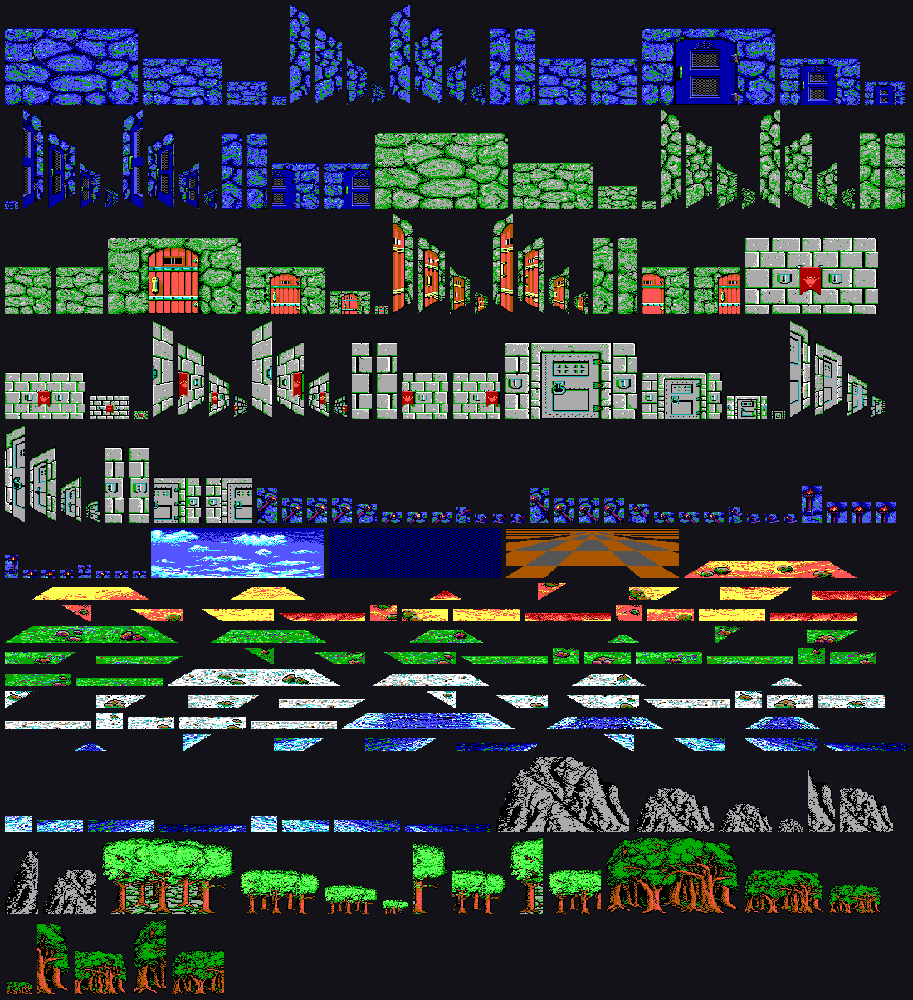

59 個怪物，各取第一張影格。

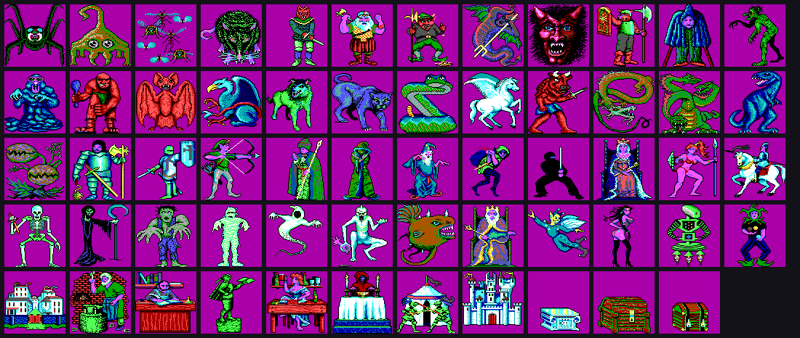

### Amiga（1989）

同一批畫重新上色成 32 色，尺寸比 DOS 少 1–3 個像素（螢幕比例不同）。
排列與 DOS 一一對應，所以 remake 按 `F6` 直接換得過去。

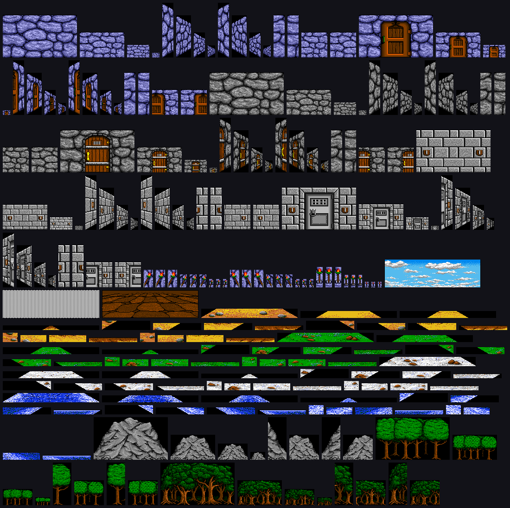

怪物在 72 個 `.anm` 檔裡，每個檔是一段動畫（檔頭 48 bytes 是每個影格的矩形表），
這裡取基準影格。

**每個 `.anm` 自帶調色盤** —— 它的本體就是一個標準的 `.32` 容器。
執行檔那邊：`sub_33A18`（動畫載入）把檔案交給 `.32` 的解析器 `sub_33322`，
後者把該檔的 64 bytes 填進送硬體的緩衝 `A4−0x4F0`，`sub_33A18` 再只把
`0x12`–`0x1F` 從畫面現有色表抄回來。所以一隻怪的顏色是**自己檔案裡的
`0x00`–`0x11`** ＋ 場景的 `0x12`–`0x1F`。推導見
[`docs/research/02-other-platforms.md`](docs/research/02-other-platforms.md)。

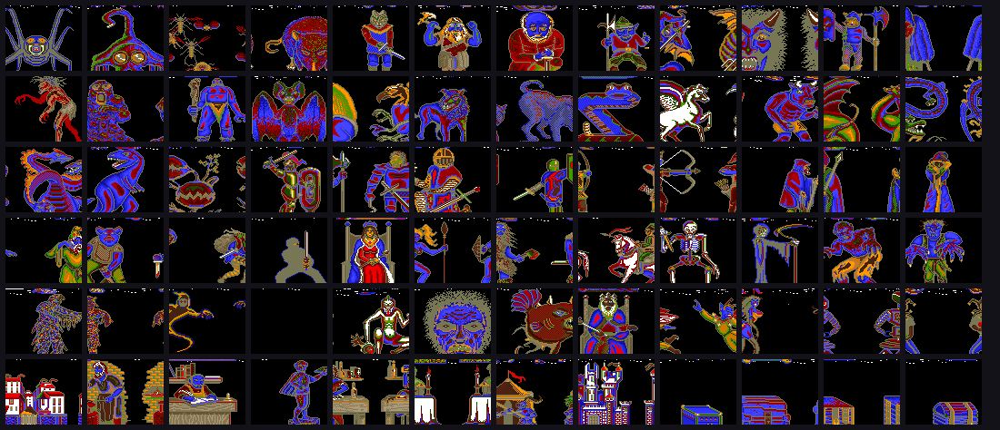

### Mega Drive（1991）

怪物圖是 **11×11 個 tile（88×88 px）**，由九個硬體 sprite 拼出來，
畫面內容由一張 nametable 決定（`raw % 242 == 0` 就是它，242 ＝ 11×11×2，
商是影格數）。ROM 裡 75 筆，與 DOS `MONSTERS.16` 的 75 個槽數量相同。

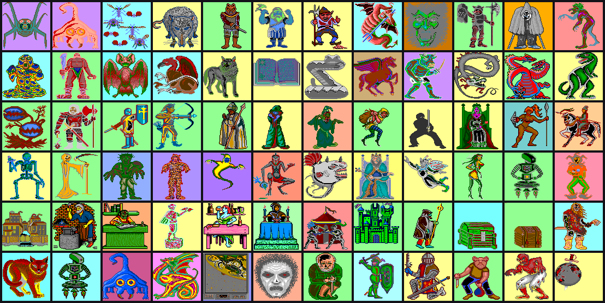

排序照 **DOS 的槽號**，所以這張與上面的 DOS、Amiga 兩張可以逐格對照；
末尾十三張是 MD 才有的（片頭的旋轉地球、書、城堡、酒館場景）。

**格子的順序是 sprite 順序不是 row-major** —— 照 row-major 攤會得到
每一格都合法、看起來卻像雜訊的東西。那張 sprite 版面是從實機的
sprite 屬性表影子（work RAM `0xFFD2A8`）讀出來的。

**怪物素材已經接進遊戲**：烘好素材包之後按 `F6`，戰鬥中的怪物會在
DOS → Mega Drive → Amiga 之間換。這兩套換的**只有怪**，牆沿用 DOS ——
想連牆一起換是循環中段那幾套場景素材，兩件事分開。`F5`／`F6` 在戰鬥中也能按，
看得到怪物的時候正是想換的時候。

| Mega Drive | Amiga |
|---|---|
| 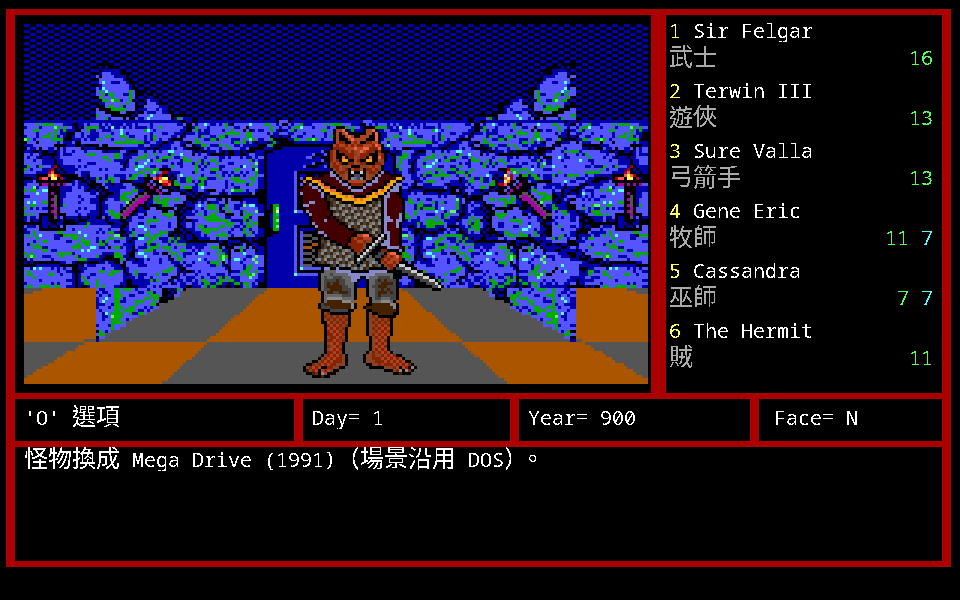 | 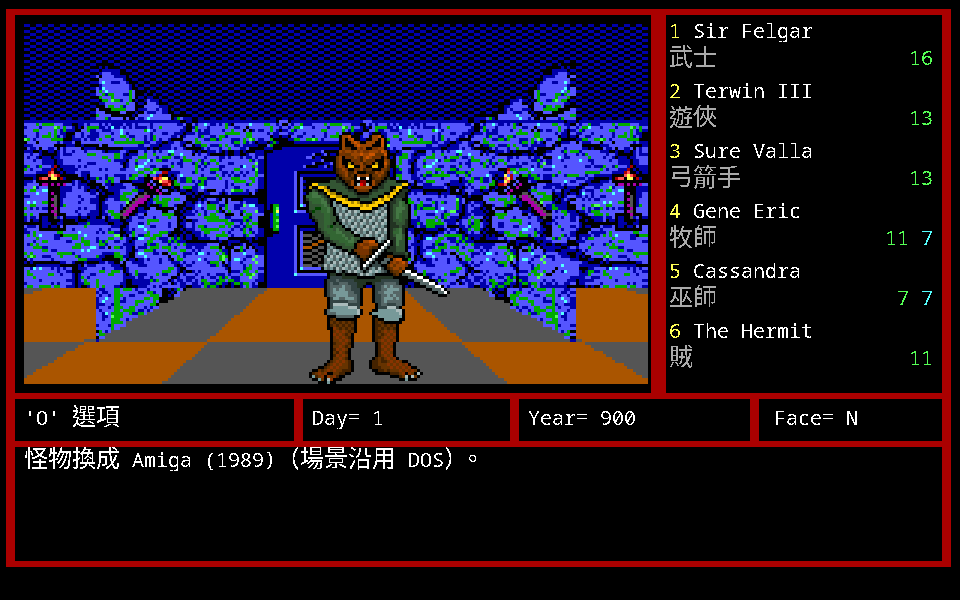 |

```bash
python3 tools/mdgfx.py "workplace/genesis/*.md" --export workplace/md-monsters \
    --data workplace/orig/MM2
python3 tools/amiga32.py --export-monsters workplace/amiga-monsters \
    workplace/orig/MM2 workplace/amiga/*.anm
```

槽號兩邊都是用剪影比對再做貪婪一對一指派對出來的（見
[`tools/monpack.py`](tools/monpack.py)）——**照檔案順序推會錯**：
Mega Drive 的順序與 DOS 槽號是一個排列，Amiga 接近恆等但從第 42 槽起
整批位移。Amiga 的 `.anm` 連動畫都解出來了：530 個影格與原版的動畫表，
remake 照那張表播，不是等速輪播。

既然 sprite 版面定案，就直接烘成檔案，不必在執行時重建：

```bash
python3 tools/mdgfx.py "workplace/genesis/*.md" --export workplace/md-monsters \
    --data workplace/orig/MM2
```

72 張圖、531 個影格的 PNG（88×88 RGBA，索引 0 透空）加一份 `set.json`。
槽號用剪影比對再做一對一指派對出來（ROM 的順序與 DOS 的槽號是一個排列），
59 個 DOS 非空槽全部對到，分數中位數 0.984；另外 13 張是 MD 才有的場景圖。
產出落在 `workplace/`，不進版控。

下面這張是 72 個 tile 池本身（去重過的圖案，順序與畫面無關）：

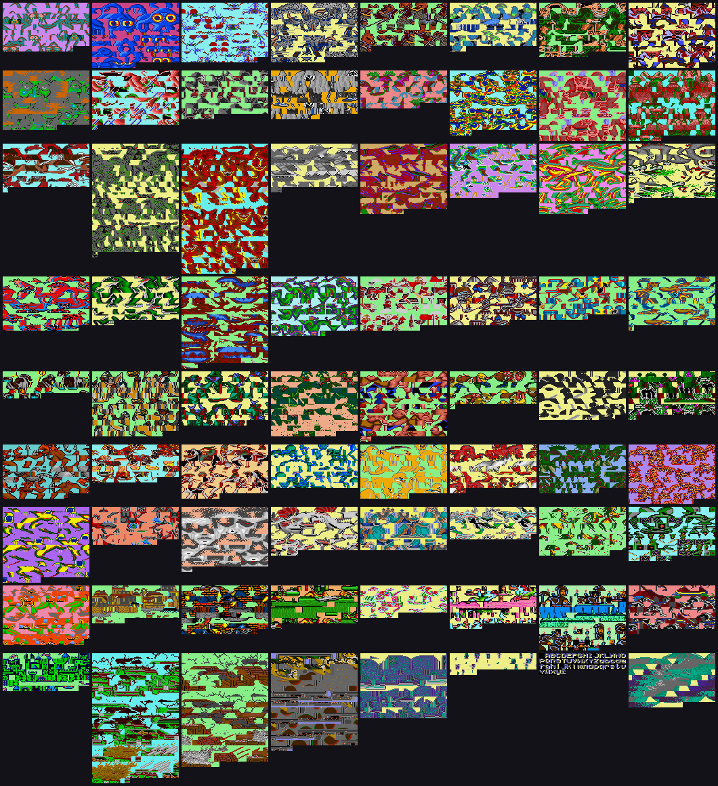

### MSX2（1989，日版）

兩片磁片共 56 張。磁片**沒有可用的檔案系統**（BPB 合法但 FAT 與根目錄
整片是零），遊戲繞過檔案系統直接讀磁區，索引是**兩張各 192 筆的表**
（磁區 1–3 與 4–6）。第一人稱的四套場景各是一張 462×128 的大圖，
天空、地板、側牆、正牆、門、火炬全在裡面 —— 畫面由 VDP 的矩形搬移
一塊一塊組出來。

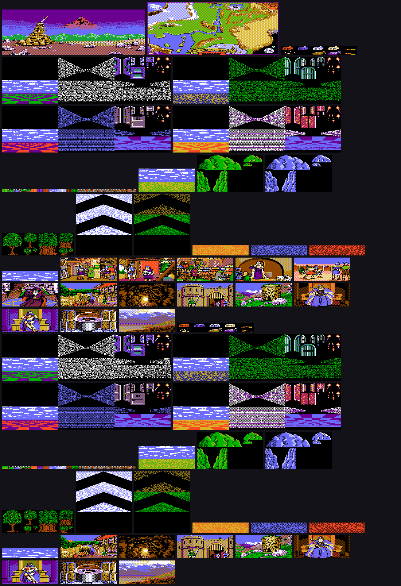

第一人稱視圖是 VDP 的矩形搬移一塊一塊組出來的。把原版的貼圖清單
（從反組譯抽出來的 `(SX,SY,NX,NY) → (DX,DY)`）跑一遍重畫出來 ——
左起：室內全部疊起來、戶外全部疊起來、側牆、正牆、門、樹。

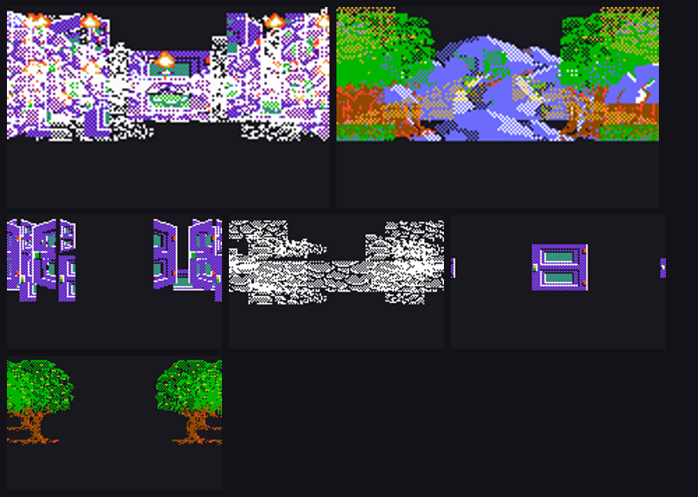

總覽圖由 `tools/sheet.py` 從各平台的抽取結果排出來：

```
tools/sheet.py docs/gallery/dos-monsters.png "workplace/gfx/mon/mon*_00.png" \
    --scale 0.5 --key 255,0,255
```

## 驗證方式

每一項結論都要有獨立於「長度剛好對」的證據：

- 標題畫面連同 13 張疊圖合成出來，與原版 DOSBox 截圖**逐像素相同**；
  透空色與每張疊圖的落點都是這樣定出來的（落點錯一格，不合的像素從 0 跳到 391）；
- EGA 調色盤由原版截圖裁決 —— 65,600 個像素 **100% 落在標準 16 色內**；
- `STR.DAT` 解出的神殿對話與原版畫面**逐字相符**，含引號與斷行位置；
- `DEFAULT.DAT` 的六個預設角色與原版名冊逐一對上；
- Go 與 Python 兩套獨立實作互相對照，其中一次成功抓出另一套的假陽性；
- 版面座標拿素材去原版截圖上做樣板比對定出來 —— 側牆**逐像素 100% 相符**，
  因此抓到 remake 的視圖整體偏了 8 px。

被推翻過的斷言集中記在 [`CONTEXT.md`](CONTEXT.md) §5。

## 文件

- [`CONTEXT.md`](CONTEXT.md) — 專案脈絡與文件索引，接手先讀這份
- [`CLAUDE.md`](CLAUDE.md) — 工作規範、硬性原則、oracle 順序
- [`docs/todo.md`](docs/todo.md) — 還沒做的事，按「會不會擋住玩家或發行」分層
- [`docs/quests.md`](docs/quests.md) — 任務線：觸發、目標、驗收、獎勵
- [`docs/tavern-rumors.md`](docs/tavern-rumors.md) — 四十則酒館傳聞的中英對照
- [`docs/re/`](docs/re/) — 反組譯筆記與函式索引
- [`docs/manual/`](docs/manual/) — 珍017 中文說明書 93 頁的轉錄，含官方譯名對照表
- `docs/formats/` — 各檔案格式的規格與證據
- `docs/research/` — 平台差異、社群成果與外部資料的考證
- `docs/playtest/` — 原版 oracle 的操作流程

## 做法

- 原版 DOS 執行檔是唯一的規則裁決者。手冊與攻略是佐證，可能描述其他平台。
- 反組譯 → 收攏成規格 → 才實作。
- 每個斷言標推論等級（已證實／強推論／假設／未知），`已證實` 要附得出證據。
- 原版 320×200 EGA 骨架與素材保持不動，中文走獨立的高解析點陣疊加層。

## 授權與素材

不散布原版執行檔、資料檔、美術或音樂。公開產出只有引擎程式碼與翻譯文本，
玩家自備合法原版。原版資料一律 gitignore；翻譯檔只存譯文與原文雜湊，不存原文。
`cmd/mm2modern` 烘出來的高解析素材包預設落在 `workplace/`，也不進版控 ——
放大過的原版美術仍然是原版美術。

上面那幾張總覽圖是例外，收在 `docs/gallery/`：它們是四個平台的原版美術，
留在這裡是為了記錄逆向的結果。**這是有意識的取捨，不是漏掉的** —— 對外釋出前
用 `tools/check_release.sh` 過一遍，並決定這批圖跟不跟著走。

## 姊妹專案

[demon_winter_cht](https://github.com/wicanr2/demon_winter_cht) — SSI《Demon's Winter》(1988)
繁中 remake，本專案的方法論、工具鏈與分層架構沿用自它。
