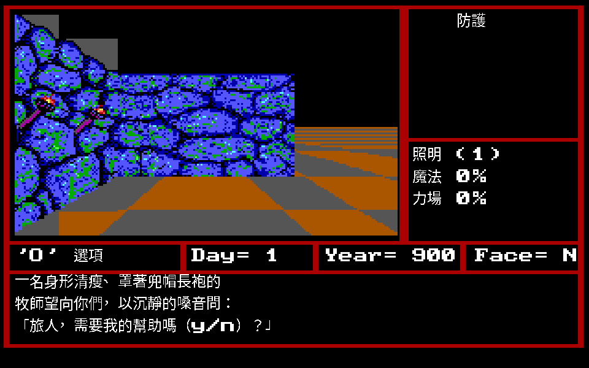

# Might and Magic II: Gates to Another World — 繁體中文 remake

把 New World Computing 1989 年的《Might and Magic II》完整逆向，在 Go / Ebiten 上
重寫引擎，再做繁體中文化。定位是文化資產保存。

## 現況

**可以玩了。** 建角色、走路、事件、戰鬥、施法、商店、旅店、神殿、訓練、
寶箱、存檔都接上了；翻譯 100% 完成。



框線照原版 —— 四個紅框圍出第一人稱視圖、右上那一格、`Day／Year／Face`
那條橫列與下方大框，座標是拿原版素材去 DOSBox 實機截圖上做樣板比對量出來的。
**框裡放什麼則按中文重新分配**：原版把隊伍擠在下面兩欄各三列，一欄 154 px
放不下完整名字，更放不下中文職業；這裡把隊伍移到右邊那一格（六列，各有
編號、完整名字、職業與生命），下方整塊留給對話。戰鬥中也看得到隊伍狀態，
原版看不到。

**中文走獨立的高解析點陣層疊在原版像素上**，原版的 320×200 骨架一個像素
都沒改。兩層疊在同一張畫布再整張送出去，所以拉動視窗時等比例一起縮放，
中文不會相對原版像素跑掉。上圖那段神殿招呼語是 `STR.DAT` 的實際譯文。

更多畫面見 [`docs/screenshots/`](docs/screenshots/)。

| 領域 | 狀態 |
|---|---|
| 中文化 | **2,695／2,695（100%）** |
| overlay 與記憶體佈局 | 14 個 overlay 反組譯完成，599 個函式 |
| 檔案格式 | 壓縮、圖形、字型、文字、地圖、事件、物品、怪物、法術全部解開 |
| 事件腳本 | 用到的 49 個 opcode 全部有語意也全部有分支，71 個非空段全部解得開 |
| 戰鬥 | 九個指令全部接上；命中、傷害、行動順序、逃走、狀態、特殊攻擊照原版 |
| 法術 | 96／96 條有效果 |
| 前端 | Ebiten 視窗；互動邏輯與視窗系統無關，headless 也跑得起來 |
| 原版 oracle | DOSBox headless，一鍵跑到第一人稱視角 |

還沒做：大腦淨化、酒館的競技賽、`MAP.DAT` 屬性層的 bit 5/3/1。

## 玩

```
go run ./cmd/mm2 -data <你的 MM2 目錄>
```

視窗可以任意拉大縮小，畫面等比例縮放並置中。

↑ 前進、↓ 後退、← → 轉向、Enter 推進、Y／N 回答、R 休息受訓、C 施法、
I 物品、B 商店、K 查說明書、M 地圖、G 開箱、N 建角色、D 撞門、U 開鎖、S 存檔；
戰鬥中 Enter 攻擊、T 射擊、C 施法、A 抵擋、F 溜跑、P 防護、V 檢視、X 對調。

## 驗證方式

每一項結論都要有獨立於「長度剛好對」的證據：

- 標題畫面 render 出來與原版 DOSBox 截圖**逐像素比對 99.92% 相同**；
- EGA 調色盤由原版截圖裁決 —— 65,600 個像素 **100% 落在標準 16 色內**；
- `STR.DAT` 解出的神殿對話與原版畫面**逐字相符**，含引號與斷行位置；
- `DEFAULT.DAT` 的六個預設角色與原版名冊逐一對上；
- Go 與 Python 兩套獨立實作互相對照，其中一次成功抓出另一套的假陽性；
- 版面座標拿素材去原版截圖上做樣板比對定出來 —— 側牆**逐像素 100% 相符**，
  因此抓到 remake 的視圖整體偏了 8 px。

被推翻過的斷言集中記在 [`CONTEXT.md`](CONTEXT.md) §5。

## 文件

- [`CONTEXT.md`](CONTEXT.md) — 專案脈絡與文件索引，接手先讀這份
- [`CLAUDE.md`](CLAUDE.md) — 工作規範、硬性原則、oracle 順序
- `docs/formats/` — 各檔案格式的規格與證據
- `docs/playtest/` — 原版 oracle 的操作流程

## 做法

- 原版 DOS 執行檔是唯一的規則裁決者。手冊與攻略是佐證，可能描述其他平台。
- 反組譯 → 收攏成規格 → 才實作。
- 每個斷言標推論等級（已證實／強推論／假設／未知），`已證實` 要附得出證據。
- 原版 320×200 EGA 骨架與素材保持不動，中文走獨立的高解析點陣疊加層。

## 授權與素材

不散布原版執行檔、資料檔、美術或音樂。公開產出只有引擎程式碼與翻譯文本，
玩家自備合法原版。原版資料一律 gitignore；翻譯檔只存譯文與原文雜湊，不存原文。

## 姊妹專案

[demon_winter_cht](https://github.com/wicanr2/demon_winter_cht) — SSI《Demon's Winter》(1988)
繁中 remake，本專案的方法論、工具鏈與分層架構沿用自它。
